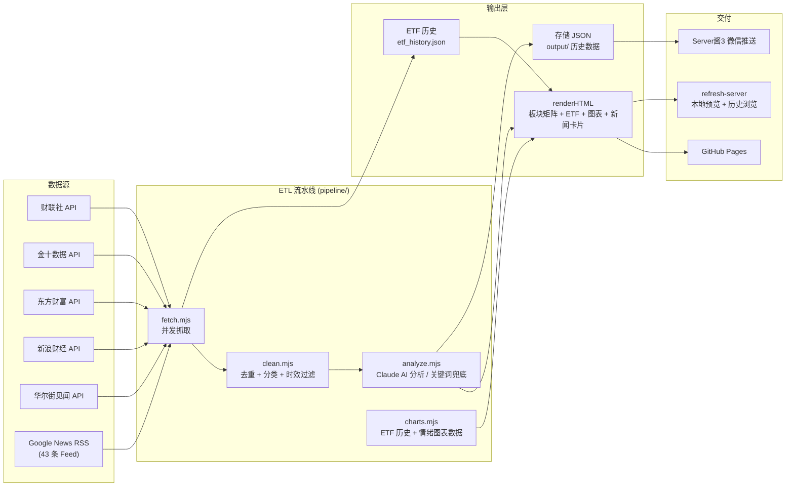

# 行业板块日报 (Daily Stock News)

> 聚焦半导体、光模块、创新药、黄金四大赛道，自动化聚合 + Claude AI 分析，生成每日产业日报并推送至微信。

---

## 架构概览



---

## 技术栈

| 层面 | 技术选型 |
|------|----------|
| 运行时 | Node.js (ESM `.mjs`, zero dependencies) |
| 数据抓取 | `fetch` API (原生 HTTP), 正则解析 XML/JSON/JS |
| AI 分析 | Claude API 或本地关键词引擎兜底 (无需密钥) |
| 渲染 | 纯字符串拼接 HTML, 内联 CSS + 原生 JS |
| 图表 | Chart.js 4.4 (CDN), 无构建时依赖 |
| 定时调度 | GitHub Actions (`cron: 0 1/8/12 * * *`, 北京时间 09/16/20, 每天含周末) + 心跳兜底 (`0 6/14 * * *`, 北京 14/22, 当天存档缺失才补建) |
| 部署 | `peaceiris/actions-gh-pages@v4` → GitHub Pages（国内可直连）；EdgeOne Pages 备用；jsDelivr 仅作静态资源 CDN（其对 `.html` 返回 text/plain，不能托管页面） |
| 推送通知 | Server酱3 (微信消息推送) |
| 本地服务 | 原生 `http` 模块, 端口 `3456`, 监听 `0.0.0.0`（容器就绪） |

**零 npm 依赖**：项目不依赖任何 npm 包，全部使用 Node.js 内置模块 (`fs`, `path`, `url`, `http`, `child_process`)。Chart.js 通过 CDN 在浏览器端加载。

---

## 在线访问

- **主链接（GitHub Pages）**：<https://cc5207597-hash.github.io/daily-stock-news/> —— 国内实测可直连（0.5~1.5s），正确渲染为网页；每次构建后由 Actions 自动部署，构建完即可看到最新日报（页面带 no-cache 控制，普通刷新即更新）
- **公网一键刷新**：网页顶部「🔄 刷新日报」按钮在公网也可用 —— 点击后经腾讯云 SCF 云函数触发 GitHub Actions 重建，约 2~6 分钟后页面自动更新到最新版（无需本机运行任何服务）
- **辅助（EdgeOne Pages 预览，国内节点）**：构建后 3 小时内可通过 EdgeOne 预览链接查看最新版（免 CDN 缓存延迟），每次构建后去 [EdgeOne 控制台](https://edgeone.cloud.tencent.com/pages) → `daily-stock-news` 项目 → 部署列表 → 预览获取。长期稳定访问需绑定已备案自定义域名
- ~~jsDelivr 镜像~~：jsDelivr 对仓库内 `.html` 文件强制返回 `text/plain`（防钓鱼的安全设计），浏览器只会显示源代码而不会渲染成网页，因此不能作为页面入口；仅作 Chart.js 等静态资源 CDN 使用
- ~~Zeabur~~：免费档已关停（2026/3 起共享集群停止接受新项目），不再作为主链接

每天（含周末）北京时间 09:00 / 16:00 / 20:00 自动构建更新；另有心跳兜底（北京 14:00 / 22:00），主时段被 GitHub cron 漂移/跳过时当天存档缺失会自动补建，保证日报当天必出。公网一键刷新通过云端代理触发，不消耗本机资源。

---

## 快速开始

```bash
# 1. 克隆仓库
git clone https://github.com/cc5207597-hash/daily-stock-news.git
cd daily-stock-news

# 2. 无需 npm install（零依赖）

# 3. 构建当日日报
node scripts/build-daily.mjs

# 4. 本地预览（含历史数据和手动刷新功能）
node scripts/refresh-server.mjs
# 打开 http://127.0.0.1:3456
```

### 环境变量

| 变量 | 说明 |
|------|------|
| `ANTHROPIC_API_KEY` | Claude API Key（CI 中通过 GitHub Secrets 注入；本地通过代理自动管理） |
| `SERVERCHAN_SENDKEY` | Server酱3 SendKey，配置后自动推送微信通知 |
| `EDGEONE_API_TOKEN` | EdgeOne Pages API Token（国内加速，待绑定备案域名后配置启用；未配置时自动跳过） |
| `REFRESH_URL` | 公网一键刷新代理地址（腾讯云 SCF 函数 URL），构建时注入前端按钮；未配置时使用代码内置默认值 |
| `REFRESH_SECRET` | 与云函数 `SHARED_SECRET` 相同的共享密钥，构建时注入前端；未配置时使用代码内置默认值 |

> 主链接 GitHub Pages 为纯静态托管，**无需任何环境变量**：构建/推送全部在 GitHub Actions 完成，每次构建后自动部署，构建完即可看到最新日报。公网一键刷新的代理地址与密钥已内置在代码中（见 `scripts/cloud-refresh.mjs` 头部注释），无需额外配置。

---

## 项目结构

```
daily-stock-news/
├── .github/workflows/
│   ├── daily.yml               # 主构建:定时(北京 09/16/20) + 手动触发,构建/提交/部署
│   └── daily-heartbeat.yml     # 心跳自愈:北京 14/22 兜底,当天存档缺失才补建
├── scripts/
│   ├── build-daily.mjs            # 构建入口（编排 ETL 流水线 + 渲染 + 推送）
│   └── refresh-server.mjs         # 本地刷新服务（端口 3456，含历史 API，仅本机）
├── pipeline/
│   ├── config.mjs                 # 配置中心（API 源、RSS Feed、ETF 列表、关键词规则）
│   ├── utils.mjs                  # 工具函数（HTML 清洗、日期格式化）
│   ├── fetch.mjs                  # 数据抓取层（5 API + 43 RSS + 12 ETF 行情）
│   ├── clean.mjs                  # 清洗层（去重、板块分类、时效性过滤）
│   ├── analyze.mjs                # AI 分析层（Claude API + 关键词引擎兜底）
│   └── charts.mjs                 # 图表数据层（ETF 历史累积、情绪/冲击/方向数据集）
├── output/                        # 构建产物
│   ├── 股市热点日报_20260804.html
│   ├── 股市热点日报_20260804.json
│   ├── etf_history.json           # ETF 价格历史（趋势图数据源）
│   └── ...
├── index.html                     # 当日日报（部署入口）
├── package.json
└── .gitignore
```

---

## 核心功能

- **模块化 ETL 流水线** — `pipeline/` 目录 6 个模块，职责分离：`fetch`（数据抓取）→ `clean`（去重分类）→ `analyze`（AI 分析）→ `charts`（图表数据），`scripts/build-daily.mjs` 负责编排 + HTML 渲染 + 推送
- **多源聚合** — 5 个中文财经 API 直连 + 43 条 Google News RSS Feed，8 路并行分批抓取。直接 API 源优先于 RSS 源去重
- **AI 智能分析** — Claude API 对新闻进行合并去噪、中文翻译、板块归类、方向判断（利好/利空/中性/分化）、影响评级（极高/高/中/低），附带确定性评分和时间窗口，每条简讯关联 A 股标的
- **关键词引擎兜底** — API 不可用时自动降级为本地关键词匹配引擎（14 条规则覆盖四大赛道），保证日报照常出
- **数据可视化** — Chart.js 渲染 4 张图表：ETF 价格走势折线图、情绪分布环形图、板块方向堆叠柱状图、冲击热力图；ETF 价格数据每日累积至 `etf_history.json`
- **板块 ETF 实时指标** — 新浪财经 `hq.sinajs.cn` 批量拉取 12 只 ETF 实时行情，按板块分组展示
- **历史数据浏览** — 每日输出 JSON 结构化数据，前端下拉框按日期回溯，刷新服务动态渲染（含图表）
- **微信推送** — Server酱3 每日推送 Markdown 摘要（板块 ETF + 核心数据 + TOP 3 + 要点）
- **一键刷新** — 网页按钮触发完整管线：重建 → git commit → git push，前端轮询状态，完成后自动重载。公网走云端代理（腾讯云 SCF 触发 Actions 重建），本机走 refresh-server（/refresh → 重建 → push）
- **GitHub Actions 全自动** — 每日北京时间 09/16/20 构建并部署到 GitHub Pages，心跳兜底 14/22 防漏

---

## 数据源详情

### 直连 API（5 路）

| 来源 | 数据特点 | 解析方式 |
|------|----------|----------|
| 财联社 (cls.cn) | 电报快讯，更新频率高 | JSON API, 提取 `roll_data` |
| 金十数据 (jin10.com) | 7x24 快讯，带【标签】格式 | JS 变量注入格式解析 |
| 东方财富 (eastmoney.com) | 综合财经新闻，多栏目 | RESTful JSON API |
| 新浪财经 (sina.com.cn) | 财经直播流 | JSON API |
| 华尔街见闻 (wallstreetcn.com) | 全球宏观 + 中国市场 | RESTful JSON API |

### Google News RSS（43 条 Feed）

覆盖中/英/日/韩多语种，按来源细分为 Reuters、Bloomberg、CNBC、WSJ、FT、Nikkei Asia、财联社、金十数据、新浪财经、华尔街见闻等。每条 Feed 按关键词精确匹配四大赛道。

### ETF 行情数据

从 `hq.sinajs.cn` 批量拉取 12 只 A 股 ETF 实时价格，无需 API Key。

---

## 本地刷新服务 API

`refresh-server.mjs` 为**本地预览专用**（`http://127.0.0.1:3456`），提供手动刷新与历史浏览：

| 方法 | 端点 | 说明 |
|------|------|------|
| `GET` | `/` | 查看最新 index.html |
| `GET` | `/history/dates` | 获取所有历史日期列表 (JSON) |
| `GET` | `/history?date=YYYYMMDD` | 查看指定日期的历史日报 |
| `POST` | `/refresh` | 触发重建 → git commit → git push |
| `GET` | `/status` | 查询刷新任务状态 |

> **注意**：`/refresh` 会执行 `git push`，因此该服务刻意只监听本机（刷新按钮在前端用 `isLocalHost()` 门控，公网域名下自动禁用）。公网站点为纯静态托管：历史下拉框读静态文件 `history/dates.json` 与 `history/日报_YYYYMMDD.html`，不需要此服务。

---

## AI 分析输出模型

| 字段 | 类型 | 说明 |
|------|------|------|
| `title_cn` | string | 中文行业简讯标题 |
| `summary_cn` | string | 客观事实提炼，含具体公司/数据 |
| `category` | enum | `半导体` / `光模块` / `创新药` / `黄金` |
| `direction` | enum | `利好` / `利空` / `中性` / `分化` |
| `impact` | enum | `极高` / `高` / `中` / `低` |
| `certainty` | enum | `高` / `中` / `低` |
| `time_window` | enum | `短期` / `中期` / `长期` |
| `tickers` | string | 关联 A 股标的 |
| `notes` | string | 补充说明 |

---

## 免责声明

本日报基于公开信息自动整理生成，AI 分析结果仅供参考，**不构成任何投资建议**。股市有风险，投资需谨慎。
